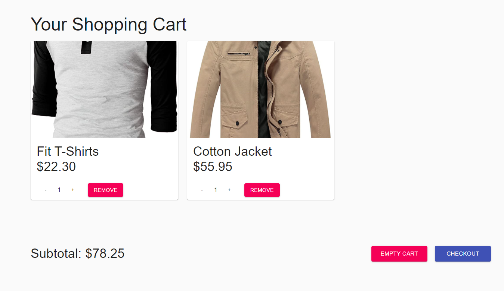
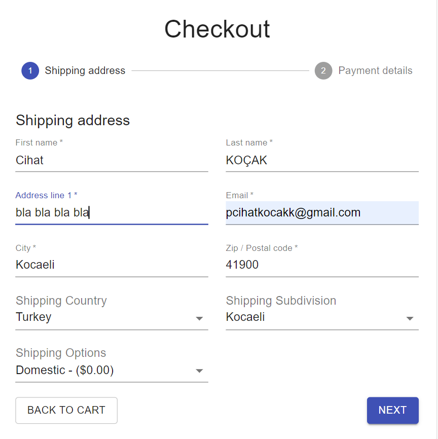
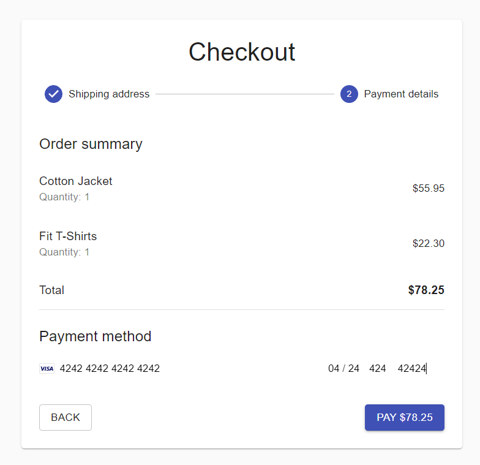
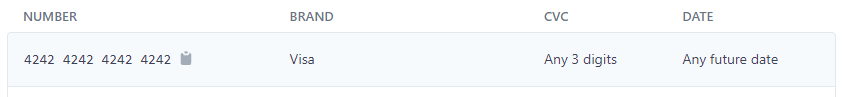
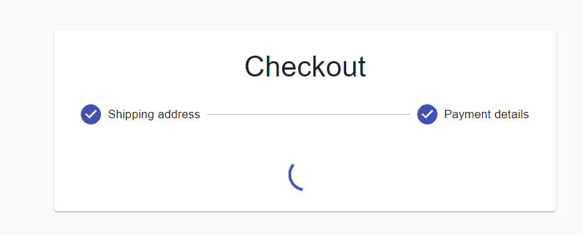
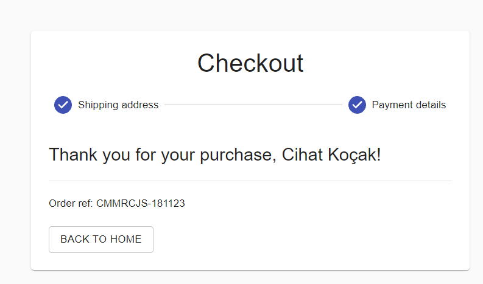
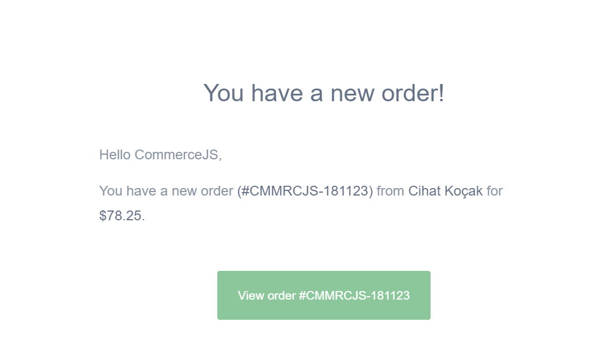
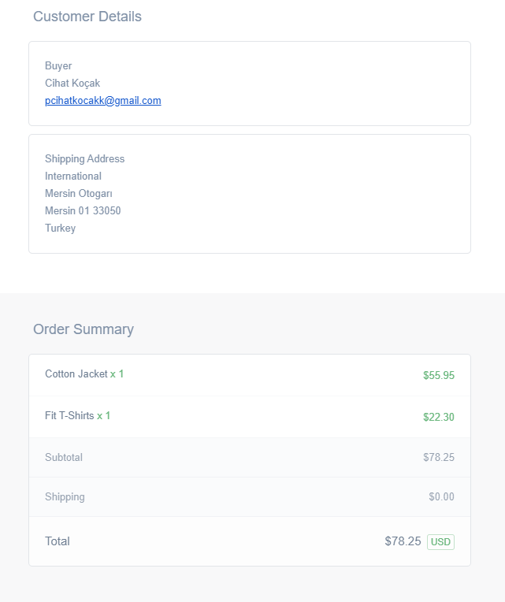

 

  

  <h3 align="center">Simple E-Commerce Theme</h3>

  

    with payment option
     
     
  

 

## About The Project

I used <a href ="dashboard.chec.io"> dashboard.chec.io</a> for products, category, users and payment method,
also I used <a href ="https://stripe.com/"> stripe</a> for payment gateway.

*Beautiful simple and useful e-commerce site theme, I will show pages and functions with pictures

## Index Page

## Shipping Cart Page

## Checkout Page

 
 

also for detailed information: <a href ="https://stripe.com/docs/testing"> Stripe Testing</a> 
 

 

## Costumer Mail

e-mail sent to the customer after the payment process is completed

## Admin Mail

e-mail sent to the administrator after the payment process is completed

## License

Distributed under the MIT License. See [LICENSE](https://github.com/iksipias/E-Commerce/blob/main/LICENSE.md) for more information.

## Author

* **Cihat KOÇAK** - [Cihat KOÇAK](https://github.com/CihatKOCAK)

## Acknowledgements

* [Adrian Hajdin](https://github.com/adrianhajdin)

